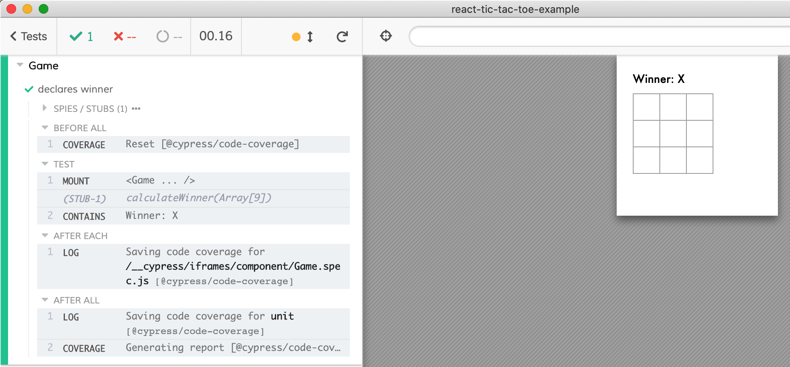

# react-tic-tac-toe-example
> React component testing example for Tic-Tac-Toe game

Tic-Tac-Toe cloned from [this sandbox](https://codepen.io/gaearon/pen/LyyXgK), then I have added [cypress-react-unit-test](https://github.com/bahmutov/cypress-react-unit-test).

Read [Tic-Tac-Toe Component Tests](https://glebbahmutov.com/blog/tic-tac-toe-component-tests/)
